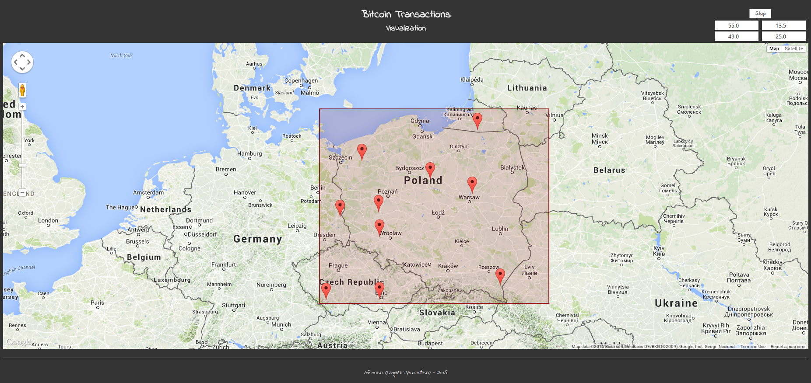
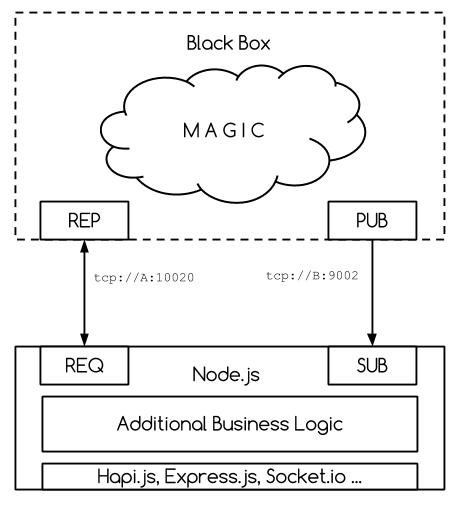

# `btc-txn-zmq-svc`

## What?

**This is a pet project**.

Sample application which is a demonstration of usage for `ZeroMQ` in :

- *Erlang*
- *Node.js*

It was used as a sample project for my talk at *Berlin.js* at *18th June 2015*.

## Overview

Application visualizes amount and place where the *Bitcoin* transactions occured. Geolocation is determined based on the IP related with a relayed transaction, in the title you can lookup a transaction hash.

Basically it is a very simple `UI` which contains a *Google Map* widget, on top of that a preselected, rectangular region and controls in the top-right corner. You can redefine a region with the coordinates controls (first row it is a *North-West* corner and second row is a *South-East* corner) and you can toggle the simulation state (*started* / *stopped*) via a button.

Underneath it is a simple *server* and *client* architecture which uses *ZeroMQ* library as a communication mechanism. *Server* is written in *Erlang* (which use `gar1t/erlang-czmq` library), client is written in *Node.js* (and uses `JustinTulloss/zeromq.node`). 

Aforementioned architecture can be approximated with a following diagram:

